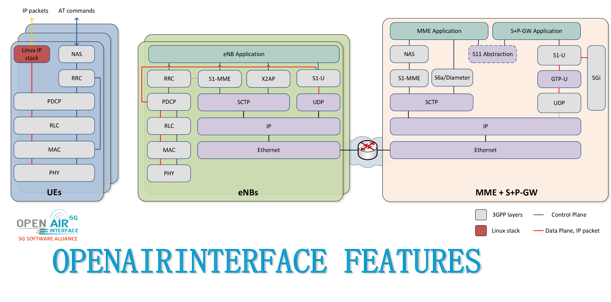
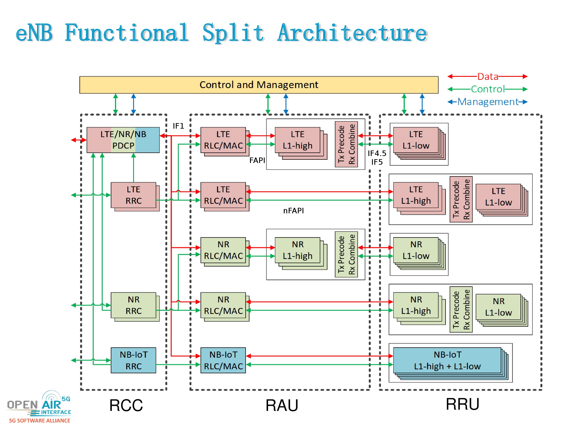

**Table of Contents**

1. [OpenAirInterface eNB Feature Set](#openairinterface-enb-feature-set)
   1. [eNB PHY Layer](#enb-phy-layer)
   2. [eNB MAC Layer](#enb-mac-layer)
   3. [eNB RLC Layer](#enb-rlc-layer)
   4. [eNB PDCP Layer](#enb-pdcp-layer)
   5. [eNB RRC Layer](#enb-rrc-layer)
   6. [eNB X2AP](#enb-x2ap)
   7. [eNB Advanced Features](#enb-advanced-features)
2. [OpenAirInterface UE Feature Set](#openairinterface-ue-feature-set)
   1.  [LTE UE PHY Layer](#lte-ue-phy-layer)
   2.  [LTE UE MAC Layer](#lte-ue-mac-layer)
   3.  [LTE UE RLC Layer](#lte-ue-rlc-layer)
   4.  [LTE UE PDCP Layer](#lte-ue-pdcp-layer)
   5.  [LTE UE RRC Layer](#lte-ue-rrc-layer)
3. [OpenAirInterface Functional Split](#openairinterface-functional-split)
4. [OpenAirInterface 5G-NR Feature Set](#openairinterface-5g-nr-feature-set)
   1. [General Parameters](#general-parameters)
   2. [gNB Features](#gnb-features)
      1. [gNB Physical Layer](#gnb-phy-layer)
      2. [gNB Higher Layers](#gnb-higher-layers)
   3. [NR UE Features](#nr-ue-features)
      1. [NR UE Physical Layer](#nr-ue-phy-layer)
      2. [NR UE Higher Layers](#nr-ue-higher-layers)

# OpenAirInterface Block diagram #

# OpenAirInterface eNB Feature Set #

## eNB PHY Layer ##

The Physical layer implements **3GPP 36.211**, **36.212**, **36.213** and provides the following features:

- LTE release 8.6 compliant, and implements a subset of release 10
- FDD and TDD configurations: 1 (experimental) and 3
- Bandwidth: 5, 10, and 20 MHz
- Transmission modes: 1, 2 (stable), 3, 4, 5, 6, 7 (experimental)
- Max number of antennas: 2
- CQI/PMI reporting: aperiodic, feedback mode 3 - 0 and 3 - 1
- PRACH preamble format 0
- All downlink (DL) channels are supported: PSS, SSS, PBCH, PCFICH, PHICH, PDCCH, PDSCH, PMCH
- All uplink (UL) channels are supported: PRACH, PUSCH, PUCCH (format 1/1a/1b), SRS, DRS
- HARQ support (UL and DL)
- Highly optimized base band processing (including turbo decoder)

### Performances ###

**Transmission Mode, Bandwidth** | **Expected Throughput** | **Measured Throughput** | **Measurement Conditions**
-------------------------------- | ----------------------- | ------------------------| ----------------:
FDD DL: 5 MHz, 25 PRBS/ MCS 28   | 16 - 17 Mbit/s          | TM1: 17.0 Mbits/s       | COTS-UE Cat 4 (150/50 Mbps)
FDD DL: 10 MHz, 50 PRBS/ MCS 28  | 34 - 35 Mbit/s          | TM1: 32.8 Mbits/s       | COTS-UE Cat 4 (150/50 Mbps)
FDD DL: 20 MHz, 100 PRBS/ MCS 28 | 70 Mbit/s               | TM1: 69.9 Mbits/s       | COTS-UE Cat 4 (150/50 Mbps)
 |  |  | 
FDD UL: 5 MHz, 25 PRBS/ MCS 20   | 9 Mbit/s                | TM1: 8.28 Mbits/s       | COTS-UE Cat 4 (150/50 Mbps)
FDD UL: 10 MHz, 50 PRBS/ MCS 20  | 17 Mbit/s               | TM1: 15.2 Mbits/s       | COTS-UE Cat 4 (150/50 Mbps)
FDD UL: 20 MHz, 100 PRBS/ MCS 20 | 35 Mbit/s               | TM1: 18.6 Mbits/s       | COTS-UE Cat 4 (150/50 Mbps)
 |  | 
TDD DL: 5 MHz, 25 PRBS/ MCS **XX**   | **TBC** Mbit/s | 3.33 Mbits/s | COTS-UE Cat 4 (150/50 Mbps)
TDD DL: 10 MHz, 50 PRBS/ MCS **XX**  | **TBC** Mbit/s | 8.90 Mbits/s | COTS-UE Cat 4 (150/50 Mbps)
TDD DL: 20 MHz, 100 PRBS/ MCS **XX** | **TBC** Mbit/s | N/A | COTS-UE Cat 4 (150/50 Mbps)
 |  | | 
TDD UL: 5 MHz, 25 PRBS/ MCS **XX**   | **TBC** Mbit/s | 1.66 Mbits/s | COTS-UE Cat 4 (150/50 Mbps)
TDD UL: 10 MHz, 50 PRBS/ MCS **XX**  | **TBC** Mbit/s | 1.89 Mbits/s | COTS-UE Cat 4 (150/50 Mbps)
TDD UL: 20 MHz, 100 PRBS/ MCS **XX** | **TBC** Mbit/s | N/A | COTS-UE Cat 4 (150/50 Mbps)

- Number of supported UEs: **To Be Completed**

## eNB MAC Layer ##

The MAC layer implements a subset of the **3GPP 36.321** release v8.6 in support of BCH, DLSCH, RACH, and ULSCH channels. 

- RRC interface for CCCH, DCCH, and DTCH
- Proportional fair scheduler (round robin scheduler soon)
- DCI generation
- HARQ Support
- RA procedures and RNTI management
- RLC interface (AM, UM)
- UL power control
- Link adaptation

## eNB RLC Layer ##

The RLC layer implements a full specification of the 3GPP 36.322 release v9.3.

- RLC TM (mainly used for BCCH and CCCH) 
  * Neither segment nor concatenate RLC SDUs
  * Do not include a RLC header in the RLC PDU
  * Delivery of received RLC PDUs to upper layers
- RLC UM (mainly used for DTCH) 
  * Segment or concatenate RLC SDUs according to the TB size selected by MAC
  * Include a RLC header in the RLC PDU
  * Duplication detection
  * PDU reordering and reassembly
- RLC AM, compatible with 9.3 
  * Segmentation, re-segmentation, concatenation, and reassembly
  * Padding
  * Data transfer to the user
  * RLC PDU retransmission in support of error control and correction
  * Generation of data/control PDUs

## eNB PDCP Layer ##

The current PDCP layer is header compliant with **3GPP 36.323** Rel 10.1.0 and implements the following functions:

- User and control data transfer
- Sequence number management
- RB association with PDCP entity
- PDCP entity association with one or two RLC entities
- Integrity check and encryption using the AES and Snow3G algorithms

## eNB RRC Layer ##

The RRC layer is based on **3GPP 36.331** v14.3.0 and implements the following functions:

- System Information broadcast (SIB 1, 2, 3, and 13)
  * SIB1: Up to 6 PLMN IDs broadcast
- RRC connection establishment
- RRC connection reconfiguration (addition and removal of radio bearers, connection release)
- RRC connection release
- RRC connection re-establishment
- Inter-frequency measurement collection and reporting (experimental)
- eMBMS for multicast and broadcast (experimental)
- Handover (experimental)
- Paging (soon)

## eNB X2AP ##

The X2AP layer is based on **3GPP 36.423** v14.6.0 and implements the following functions:

 - X2 Setup Request
 - X2 Setup Response 

## eNB Advanced Features ##

**To be completed**

# OpenAirInterface UE Feature Set #

## LTE UE PHY Layer ##

The Physical layer implements **3GPP 36.211**, **36.212**, **36.213** and provides the following features:

- LTE release 8.6 compliant, and implements a subset of release 10
- FDD and TDD configurations: 1 (experimental) and 3
- Bandwidth: 5, 10, and 20 MHz
- Transmission modes: 1, 2 (stable)
- Max number of antennas: 2
- CQI/PMI reporting: aperiodic, feedback mode 3 - 0 and 3 - 1
- PRACH preamble format 0
- All downlink (DL) channels are supported: PSS, SSS, PBCH, PCFICH, PHICH, PDCCH, PDSCH, PMCH
- All uplink (UL) channels are supported: PRACH, PUSCH, PUCCH (format 1/1a/1b), SRS, DRS

## LTE UE MAC Layer ##

The MAC layer implements a subset of the **3GPP 36.321** release v8.6 in support of BCH, DLSCH, RACH, and ULSCH channels. 

- RRC interface for CCCH, DCCH, and DTCH
- HARQ Support
- RA procedures and RNTI management
- RLC interface (AM, UM)
- UL power control
- Link adaptation

## LTE UE RLC Layer ##

The RLC layer implements a full specification of the 3GPP 36.322 release v9.3.

## LTE UE PDCP Layer ##

The current PDCP layer is header compliant with **3GPP 36.323** Rel 10.1.0.

## LTE UE RRC Layer ##

The RRC layer is based on **3GPP 36.331** v14.3.0 and implements the following functions:

- System Information decoding
- RRC connection establishment

# OpenAirInterface Functional Split #

-  RCC: Radio-Cloud Center
-  RAU: Radio-Access Unit
-  RRU: Remote Radio-Unit

-  IF4.5 / IF5 : similar to IEEE P1914.1
-  FAPI (IF2)  : specified by Small Cell Forum (open-nFAPI implementation)
-  IF1         : F1 in 3GPP Release 15

# OpenAirInterface 5G-NR Feature Set #

## General Parameters ##

The following features are valid for the gNB and the 5G-NR UE.

*  Static TDD, 
*  Normal CP
*  30 kHz subcarrier spacing
*  Bandwidths up to 80MHz (217 Physical Resource Blocks)
*  Single antenna port (single beam)
*  Slot format: 14 OFDM symbols in UL or DL
*  Highly efficient 3GPP compliant LDPC encoder and decoder (BG1 and BG2 supported)
*  Highly efficient 3GPP compliant polar encoder and decoder
*  Encoder and decoder for short blocks

## gNB Features ##

### gNB PHY Layer ###

*  Generation of PSS/SSS/PBCH for multiple beams and
*  Generation of PDCCH for SIB1 (including generation of DCI, polar encoding, scrambling, modulation, RB mapping, etc)
   - common search space configured by MIB
   - user-specific search space configured by RRC
   - DCI formats: 00, 10
*  Generation of PDSCH (including Segmentation, LDPC encoding, rate matching, scrambling, modulation, RB mapping, etc).
   - Single symbol DMRS, dmrs-TypeA-Position Pos2,  DMRS configuration type 1
   - PDSCH mapping type A 
*  NR-PUSCH (including Segmentation, LDPC encoding, rate matching, scrambling, modulation, RB mapping, etc).
*  NR-PUCCH 
   - Format 0 (ACK/NACK)
   
### gNB higher Layers ###
  
- NR RRC (38.331) Rel 15 messages using new asn1c 
- LTE RRC (36.331) also updated to Rel 15 
- Generation of MIB
- Application to read configuration file and program gNB RRC
- RRC -> MAC configuration
- MAC -> PHY configuration (using NR FAPI P5 interface)
- FAPI P7 interface for BCH PDU, DCI PDU, PDSCH PDU

For more details see [this document](https://gitlab.eurecom.fr/oai/openairinterface5g/uploads/ba5368448d627743a28c770c29e8978e/OAI_Software_Architecture_for_Dual_Connectivity_in_E-UTRA_and_5G-NR_and_nFAPI_for_MAC-PHY_Interface.docx)

## NR UE Features ##

### NR UE PHY Layer ###

- initial synchronization
- Time tracking based on PDCCH DMRS
- Frequency offset estimation
- PBCH RX
- PDCCH RX 
- PDSCH RX
  - including first version of dual stream receiver for PDSCH

### NR UE higher Layers ###

For more details see [this document](https://gitlab.eurecom.fr/oai/openairinterface5g/uploads/f7386f3a64806fd6b2ac1fc3d0252fff/UE_FAPI-like_interface.docx)

