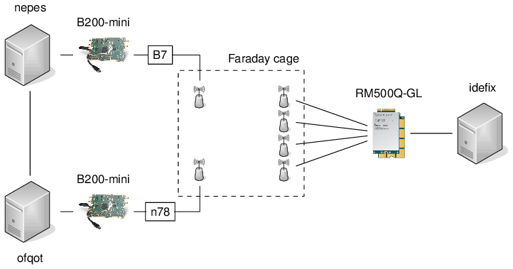
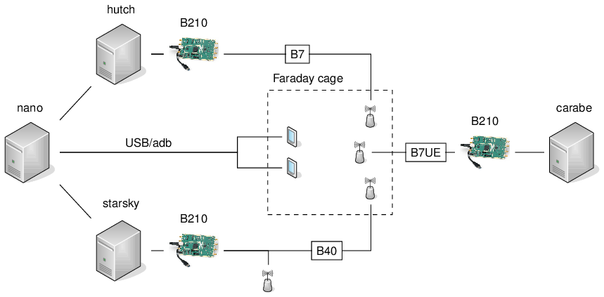

## Table of Contents ##

1.   [Machines](#machines)
2.   [Networked devices](#networked-devices)
3.   [Testbenches](#testbenches)
4.   [Pipelines](#pipelines)

## Machines

| Machine       | IP address      | Lockable Resource     | Function           | Connected devices                                     |
| ------------- | --------------- | --------------------- | ------------------ | ----------------------------------------------------- |
| asterix       | 172.21.16.127   | CI-Asterix-Usage      | gNB (n78)          | 173.21.19.14                                          |
| obelix        | 172.21.16.128   | CI-Obelix-Usage       | eNB (n40, n78), nrUE | 172.21.19.13, X300 (192.168.60.2), B200mini (30C51EB) |
| porcepix      | 172.21.16.136   | CI-NSA-MiniBench      | Executor, EPC, 5GC | --                                                    |
| nrmodule2     | 172.21.16.139   | CI-NSA-MiniBench      | Quectel            | Quectel module                                        |
| nepes         | 172.21.16.137   | CI-NSA-MiniBench      | gNB (n78)          | B200mini (30C51D4)                                    |
| caracal       | 172.21.16.132   | CI-Caracal            | gNB/phytest        | N300 (192.168.10.2)                                   |
| idefix        | 172.21.16.135   | CI-NSA-MiniBench      | Quectel            | Quectel module                                        |
| amariue       | 172.21.16.144   | CI-Amarisoft-UE-Usage | nrUE               | Amarisoft UE simulator                                |
| bellatrix     | 192.168.117.115 | CI-RAN-VM-Deployment  | Executor           | --                                                    |
| nano          | 192.168.12.62   | CI-Bench-1-Phones     | EPC, adb           | 2x COTS (adb)                                         |
| hutch         | 192.168.12.19   | CI-Bench-1-Phones     | eNB (B7)           | B200mini (30C5239)                                    |
| starsky       | 192.168.12.18   | CI-Bench-1-Phones     | eNB (B40)          | b200mini (30A3E3C)                                    |
| carabe        | 192.168.12.211  | CI-Bench-2-OAI-Phone  | UE (B7UE)          | B200mini (30AE8C9)                                    |

Note: The available resources, and their current usage, is indicated here:
- [Lockable resources of jenkins-oai](https://jenkins-oai.eurecom.fr/lockable-resources/):
  "New" Jenkins, i.e., with RAN-Container-Parent
- [Lockable resources of open5glab jenkins](https://open5glab.eurecom.fr:8083/jenkins/lockable-resources/):
  "Old" Jenkins, i.e., with RAN-CI-Develop

## Networked devices

| Type          | IP address (mgmt) |
| ------------- | ----------------- |
| USRP N310     | 172.21.19.14      |
| USRP N310     | 172.21.19.13      |

## Testbenches

### OTA Testbench

**Purpose**: Over-the-air 4G/5G (NSA/SA) tests

Note: obelix and porcepix are both used in the OTA testbench and the 5G
NSA/Faraday Cage testbench!

[PDF version](testbenches_doc_resources/5g-ota-bench.pdf) | [LaTeX/TikZ version](testbenches_doc_resources/5g-ota-bench.tex) if you want to modify to reflect your setup

### 5G NSA/Faraday Cage Testbench

**Purpose**: Faraday cage 5G tests

Note: obelix and porcepix are both used in the OTA testbench and the 5G
NSA/Faraday Cage testbench!

[PDF version](testbenches_doc_resources/5g-nsa-faraday-bench.pdf) | [LaTeX/TikZ version](testbenches_doc_resources/5g-nsa-faraday-bench.tex) if you want to modify to reflect your setup

### 4G Testbench(es)

**Purpose**: 4G/LTE testbenches

[PDF version](testbenches_doc_resources/4g-faraday-bench.pdf) | [LaTeX/TikZ version](testbenches_doc_resources/4g-faraday-bench.tex) if you want to modify to reflect your setup

## Pipelines

### [RAN-Container-Parent](https://jenkins-oai.eurecom.fr/job/RAN-Container-Parent/)

**Purpose**: automatically triggered tests on MR creation or push, from Gitlab
Webhook

- [RAN-cppcheck](https://jenkins-oai.eurecom.fr/job/RAN-cppcheck/1664/)
  - obelix
  - performs static code analysis, currently not actively enforced
- [RAN-gNB-nrUE-MONO-TDD-Band78-N300](https://jenkins-oai.eurecom.fr/job/RAN-gNB-nrUE-MONO-TDD-Band78-N300/)
  - caracal + N310
  - pure performance test through phy-test scheduler, see command line for more
    details
- [RAN-L2-Sim-Test-5G](https://jenkins-oai.eurecom.fr/job/RAN-L2-Sim-Test-4G/)
  - obelix (eNB, 1x UE, OAI EPC)
  - L2simulator: skips physical layer and uses proxy between eNB and UE
- [RAN-L2-Sim-Test-5G](https://jenkins-oai.eurecom.fr/job/RAN-L2-Sim-Test-5G/)
  - obelix (gNB, 1x UE, OAI 5GC)
  - L2simulator: skips physical layer and uses proxy between gNB and UE,
    currently only ping
- [RAN-NSA-B200-Module-LTEBOX-Container](https://jenkins-oai.eurecom.fr/job/RAN-NSA-B200-Module-LTEBOX-Container/)
  - obelix + B200, nepes + B200, idefix + Quectel, porcepix w/ ltebox
  - basic NSA test
- [RAN-SA-B200-Module-SABOX-Container](https://jenkins-oai.eurecom.fr/job/RAN-SA-B200-Module-SABOX-Container/)
  - obelix + B200, nepes + B200, idefix + Quectel, porcepix w/ sabox
  - basic SA test (40 MHz TDD)
- [RAN-PhySim-Cluster](https://jenkins-oai.eurecom.fr/job/RAN-PhySim-Cluster/)
  - asterix (`Asterix-OC-oaicicd-session` resource), tests in OpenShift Cluster
  - unitary simulators (`nr_dlsim`, etc.)
- [RAN-RF-Sim-Test-4G](https://jenkins-oai.eurecom.fr/job/RAN-RF-Sim-Test-4G/)
  - obelix (eNB, 1x UE, OAI EPC)
  - uses RFsimulator, for FDD 5, 10, 20MHz with core, 5MHz noS1
- [RAN-RF-Sim-Test-5G](https://jenkins-oai.eurecom.fr/job/RAN-RF-Sim-Test-5G/)
  - obelix (gNB, 2x UE, OAI 5GC)
  - uses RFsimulator, TDD 40MHz, FDD 40MHz, F1 split
- [RAN-RHEL8-Cluster-Image-Builder](https://jenkins-oai.eurecom.fr/job/RAN-RHEL8-Cluster-Image-Builder/)
  - asterix (`Asterix-OC-oaicicd-session` resource): RHEL 8 image build using
    the OpenShift in Eurecom
- [RAN-Ubuntu18-Image-Builder](https://jenkins-oai.eurecom.fr/job/RAN-Ubuntu18-Image-Builder/)
  - obelix: Ubuntu 18 image build using docker

### [RAN-CI-NSA-Trigger](https://jenkins-oai.eurecom.fr/view/RAN/job/RAN-CI-NSA-Trigger/)

**Purpose**: longer-running over-the-air LTE, NSA, and SA tests, triggered
through cron job at midnight

- [RAN-LTE-2x2-Module-OAIEPC](https://jenkins-oai.eurecom.fr/job/RAN-LTE-2x2-Module-OAIEPC/)
  - obelix + N310, nrmodule2 + Quectel, porcepix w/ Magma EPC
  - LTE 2x2 test with TM1 and TM2
- [RAN-NSA-B200-Module-LTEBOX](https://jenkins-oai.eurecom.fr/job/RAN-NSA-B200-Module-LTEBOX/)
  - obelix + B200 (eNB), nepes + B200 (gNB), idefix + Quectel, porcepix w/ ltebox
  - Note: like [RAN-NSA-B200-Module-LTEBOX-Container](https://jenkins-oai.eurecom.fr/job/RAN-NSA-B200-Module-LTEBOX-Container/) above, but compiled/run from source
- [RAN-NSA-2x2-Module-OAIEPC](https://jenkins-oai.eurecom.fr/job/RAN-NSA-2x2-Module-OAIEPC/)
  - obelix + N310 (eNB), asterix + N310 (gNB), nrmodule2 + Quectel, porcepix w/ Magma EPC
  - LTE 2x2 and NR 2x2 (non-standalone)
- [RAN-SA-Module-CN5G](https://jenkins-oai.eurecom.fr/view/RAN/job/RAN-SA-Module-CN5G/)
  - asterix + N310 (gNB), nrmodule2 + Quectel, porcepix w/ OAI 5GC
  - NR 2x2 (standalone)
- [RAN-SA-OAIUE-N310-X300-CN5G](https://jenkins-oai.eurecom.fr/job/RAN-SA-OAIUE-N310-X300-CN5G/)
  - asterix + N310 (gNB), obelix + N310 or X300 (5G UE), porcepix w/ OAI 5GC
  - OTA test with OAIUE using both N310 and X300
- [RAN-SA-AmariS-CN5G](https://jenkins-oai.eurecom.fr/view/RAN/job/RAN-SA-AmariS-CN5G/)
  - asterix + N310, amariue (1x UE), porcepix w/ OAI 5GC
  - Amarisoft UE simulator: expected to be increased to more UEs

### [RAN-CI-develop](https://open5glab.eurecom.fr:8083/jenkins/job/RAN-CI-develop/)

**Purpose**: automatically triggered tests, mostly 4G, to be phased out and
integrated into RAN-Container-Parent

runs tests:
- bellatrix: runs 4G/5G simulators directly (eNB + 1x UE + (opt.) OAI EPC, gNB + 1x UE in "noS1")

triggers pipelines:
- [eNB-CI-F1-FDD-Band7-B210](https://open5glab.eurecom.fr:8083/jenkins/job/eNB-CI-F1-FDD-Band7-B210/)
  - hutch + B210, nano w/ ltebox + 2x UE
  - tests 4G FDD with F1 split, 5MHz, 10MHz, 20MHz. 5MHz stable, rest known to
    be unstable
- [eNB-CI-FDD-Band7-B210](https://open5glab.eurecom.fr:8083/jenkins/job/eNB-CI-FDD-Band7-B210/)
  - hutch + B210, nano w/ ltebox + 2x UE
  - tests T tracer, information through FlexRAN, RRC inactivity timers,
    inactivity timers + FlexRAN, different bandwidths
- [eNB-CI-IF4p5-FDD-Band7-B210](https://open5glab.eurecom.fr:8083/jenkins/job/eNB-CI-IF4p5-FDD-Band7-B210/)
  - hutch + B210, nano w/ ltebox + 2x UE
  - tests IF4.5 split over bandwidths 5, 10, 20 MHz in Band 7
- [eNB-CI-IF4p5-TDD-Band40-B210](https://open5glab.eurecom.fr:8083/jenkins/job/eNB-CI-IF4p5-TDD-Band40-B210/)
  - starsky + B210, nano w/ ltebox + 2x UE
  - tests IF4.5 split over bandwidths 5, 10, 20 MHz in Band 40
- [eNB-CI-TDD-Band40-B210](https://open5glab.eurecom.fr:8083/jenkins/job/eNB-CI-TDD-Band40-B210/)
  - starsky + B210, nano w/ ltebox + 2x UE
  - T tracer, TM1 over bandwidths 5, 10, 20 MHz in Band 40, default scheduler
    for 20 MHz
- [eNB-UE-CI-MONO-FDD-Band7-B200](https://open5glab.eurecom.fr:8083/jenkins/job/eNB-UE-CI-MONO-FDD-Band7-B200/)
  - hutch + B210 (eNB), carabe + B210 (4G UE), nano w/ ltebox
  - tests OAI 4G for 5 MHz/TM1 with both CN and in noS1 model, MBMS; known to
    be unstable
- [UE-CI-FDD-Band20-B200](https://open5glab.eurecom.fr:8083/jenkins/job/UE-CI-FDD-Band20-B200/)
  - starsky + B210 (sniffer)
  - Sniff MIB + SIB1 of Orange, SFR
