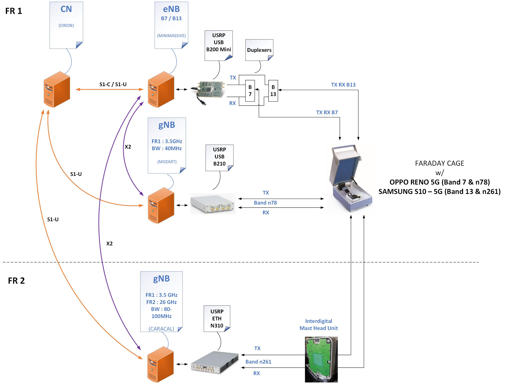

DISCLAIMER : This page is under complete review and update, thanks for your patience

## Configuration Overview:

* Non Standalone (NSA) configuration  : initial Control Plane established between UE and RAN eNB, then User Plane established between UE and gNB, Core network is 4G based supporting rel 15

* Commercial UE: Oppo Reno 5G
* OAI Software Defined gNB and eNB
* eNB RF front end: USRP (ETTUS) B200 Mini or B210
* gNB RF front end: USRP (ETTUS) B200 Mini or B210 (N310 will be needed for MIMO and wider BW's)
* 5G TDD duplexing mode
* 5G FR1 Band n78 (3.5 GHz)
* BW: 40MHz
* Antenna scheme: SISO

## SW Repository / Branch

https://gitlab.eurecom.fr/oai/openairinterface5g/tree/develop

## Architecture Setup

The scheme below depicts our typical setup:



The photo depicts the FR1 setup part of the scheme above:  


## Build / Install

General guidelines for building :
See https://gitlab.eurecom.fr/oai/openairinterface5g/blob/develop/doc/BUILD.md#building-ues-enodeb-and-gnodeb-executables

- **EPC**

for reference:
https://github.com/OPENAIRINTERFACE/openair-epc-fed/blob/master-documentation/docs/DEPLOY_HOME.md


- **eNB**

```
sudo 
```

- **gNB**

```
sudo 
```

## Configuration Files

Each component (EPC, eNB, gNB) has its own configuration file.  
These config files are passed as arguments of the run command line, using the option -O \<conf file\>

Some config examples can be found in the following folder:  
https://gitlab.eurecom.fr/oai/openairinterface5g/-/tree/develop/targets/PROJECTS/GENERIC-LTE-EPC/CONF

These files have to be updated manually to set the IP addresses and frequency.  

1- In the **eNB configuration file** :
- look for MME IP address, and update the **ipv4 field** with the IP address of the **EPC** server
```
    ////////// MME parameters:
    mme_ip_address      = ( { ipv4       = "**YOUR_EPC_IP_ADDR**";
                              ipv6       = "192:168:30::17";
                              active     = "yes";
                              preference = "ipv4";
                            }
                          );

```

- look for S1 IP address, and update the **3 fields below** with the IP address of the **eNB** server  
```
    NETWORK_INTERFACES :
    {
        ENB_INTERFACE_NAME_FOR_S1_MME            = "eth0";
        ENB_IPV4_ADDRESS_FOR_S1_MME              = "**YOUR_ENB_IP_ADDR**";
        ENB_INTERFACE_NAME_FOR_S1U               = "eth0";
        ENB_IPV4_ADDRESS_FOR_S1U                 = "**YOUR_ENB_IP_ADDR**";
        ENB_PORT_FOR_S1U                         = 2152; # Spec 2152
        ENB_IPV4_ADDRESS_FOR_X2C                 = "**YOUR_ENB_IP_ADDR**";
        ENB_PORT_FOR_X2C                         = 36422; # Spec 36422
    };

```

2- In the **gNB configuration file** :
- look for MME IP address, and update the **ipv4 field** with the IP address of the **EPC** server
```
    ////////// MME parameters:
    mme_ip_address      = ( { ipv4       = "**YOUR_EPC_IP_ADDR**";
                              ipv6       = "192:168:30::17";
                              active     = "yes";
                              preference = "ipv4";
                            }
                          );
```
- look for X2 IP address, and update the **4 fields** with the IP address of the **eNB** server (notice : even if -in principle- S1 MME is not required for gNB setting)
```

    ///X2
    enable_x2 = "yes";
    t_reloc_prep      = 1000;      /* unit: millisecond */
    tx2_reloc_overall = 2000;      /* unit: millisecond */
    target_enb_x2_ip_address      = (
                                     { ipv4       = "**YOUR_ENB_IP_ADDR**";
                                       ipv6       = "192:168:30::17";
                                       preference = "ipv4";
                                     }
                                    );

    NETWORK_INTERFACES :
    {

        GNB_INTERFACE_NAME_FOR_S1_MME            = "eth0";
        GNB_IPV4_ADDRESS_FOR_S1_MME              = "**YOUR_ENB_IP_ADDR**";
        GNB_INTERFACE_NAME_FOR_S1U               = "eth0";
        GNB_IPV4_ADDRESS_FOR_S1U                 = "**YOUR_ENB_IP_ADDR**";
        GNB_PORT_FOR_S1U                         = 2152; # Spec 2152
        GNB_IPV4_ADDRESS_FOR_X2C                 = "**YOUR_ENB_IP_ADDR**";
        GNB_PORT_FOR_X2C                         = 36422; # Spec 36422
    };

    
```


3- The frequency setting requires a manual update in the .C and in the gNB conf file:


In the C file **openair2/RRC/LTE/rrc_eNB.c:3217**  
set the nrarfcn to the same value as absoluteFrequencySSB in the **gNB config file**, that is **641272** in the example below 

C file :
```
MeasObj2->measObject.choice.measObjectNR_r15.carrierFreq_r15 =641272;
```

gNB config file :

```
    # absoluteFrequencySSB is the central frequency of SSB 
    absoluteFrequencySSB                                          = 641272; 
    dl_frequencyBand                                                 = 78;
    # the carrier frequency is assumed to be in the middle of the carrier, i.e. dl_absoluteFrequencyPointA_kHz + dl_carrierBandwidth*12*SCS_kHz/2
    dl_absoluteFrequencyPointA                                       = 640000;
    #scs-SpecificCarrierList
    dl_offstToCarrier                                              = 0;
    # subcarrierSpacing
    # 0=kHz15, 1=kHz30, 2=kHz60, 3=kHz120  
    dl_subcarrierSpacing                                           = 1;
    dl_carrierBandwidth                                            = 106;
```


## Run / Test


- **EPC** (on EPC host):

for reference:
https://github.com/OPENAIRINTERFACE/openair-epc-fed/blob/master-documentation/docs/DEPLOY_HOME.md


- **eNB** (on the eNB host):

```
~/openairinterface5g/cmake_targets/ran_build/build$ sudo ./lte-softmodem -O ../../../targets/PROJECTS/GENERIC-LTE-EPC/CONF/enb.band7.tm1.50PRB.usrpb210.conf (-E)
```


- **gNB** (on the gNB host)

```
~/openairinterface5g/cmake_targets/ran_build/build$ sudo ./nr-softmodem -O ../../../targets/PROJECTS/GENERIC-LTE-EPC/CONF/gnb.band78.tm1.106PRB.usrpn300.conf (-E)
```


## Test Case

Test case description  : UE attachement

## Expected Logs to check

what logs and where to check, to ensure that your setup works fine (or not ...)

## Required traces for debug

What info/traces/logs are needed for us to support the debug

## Status of the interoperability

The following parts have been validated with FR1 COTS UE:

- Phone accepts the configurtion provided by OAI eNB:  
    this validates RRC and X2AP  

- Successful Random Access Procedure:  
    PRACH is correctly decoded at gNB  
    Phone correctly receives and decodes msg2 (NR PDCCH Format 1_0 and NR PDSCH)  
    msg3  is transmitted to gNB according to the configuration sent in msg2, and received correctly at gNB    

- Successful path switch of user plane traffic from 4G to 5G cell (E-RAB modification message):  
   this validates S1AP  

- Downlink traffic:  
    PDCCH DCI format 1_1 and correponding PDSCH are decoded correctlyby the phone  
    ACK/NACK (PUCCH format 0) are successfully received at gNB  

- On going:  
    validation of HARQ procedures  
    Integration with higher layers to replace dummy data with real traffic  
    
- Known limitations as of May 2020:  
    only dummy DL traffic  
    no UL traffic  
    no end-to-end traffic possible  


