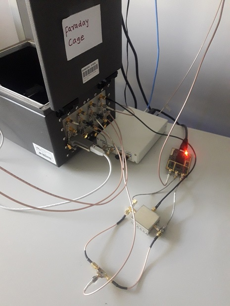
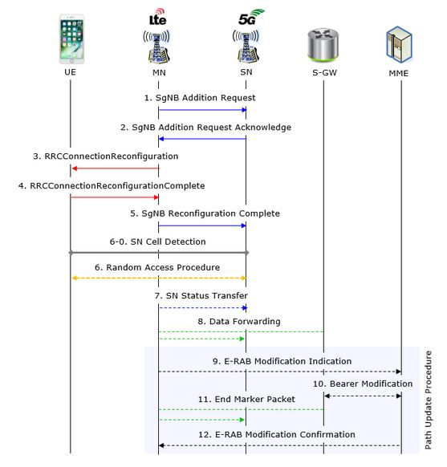

STATUS 2020/07/30 : under continuous improvement ; updated the configuration files links with CI approved reference files


## Table of Contents ##

1.   [Configuration Overview](#configuration-overview)
2.   [SW Repository / Branch](#repository)
3.   [Architecture Setup](#architecture-setup)
4.   [Build / Install](#build-and-install)
5.   [Run / Test](#run-and-test)
6.   [Test case](#test-case)
7.   [Log file monitoring](#log-file-monitoring)
6.   [Required tools for debug](#required-tools-for-debug)
7.   [Status of interoperability](#status-of-interoperability) 

## Configuration Overview

* Non Standalone (NSA) configuration  : initial Control Plane established between UE and RAN eNB, then User Plane established between UE and gNB, Core network is 4G based supporting rel 15

* Commercial UE: Oppo Reno 5G
* OAI Software Defined gNB and eNB
* eNB RF front end: USRP (ETTUS) B200 Mini or B210
* gNB RF front end: USRP (ETTUS) B200 Mini or B210 (N310 will be needed for MIMO and wider BW's)
* 5G TDD duplexing mode
* 5G FR1 Band n78 (3.5 GHz)
* BW: 40MHz
* Antenna scheme: SISO

## Repository

https://gitlab.eurecom.fr/oai/openairinterface5g/tree/develop

## Architecture Setup

The scheme below depicts our typical setup:


The photo depicts the FR1 setup part of the scheme above:  




## Build and Install

General guidelines to build eNB and gNB :
See https://gitlab.eurecom.fr/oai/openairinterface5g/blob/develop/doc/BUILD.md#building-ues-enodeb-and-gnodeb-executables


- **eNB**

```
cd <your oai installation directory>/openairinterface5g/
source oaienv
cd cmake_targets/
./build_oai -I -w USRP --eNB

```

- **gNB**

```
cd <your oai installation directory>/openairinterface5g/
source oaienv
cd cmake_targets/
./build_oai -I -w USRP --gNB
```


- **EPC**

for reference:
https://github.com/OPENAIRINTERFACE/openair-epc-fed/blob/master-documentation/docs/DEPLOY_HOME.md


## Configuration Files

Each component (EPC, eNB, gNB) has its own configuration file.  
These config files are passed as arguments of the run command line, using the option -O \<conf file\>

The **REFERENCE** files for eNB and gNB, **used by the CI**, can be found here:  
[enb conf file](../ci-scripts/conf_files/enb.band7.tm1.fr1.25PRB.usrpb210.conf)
[gnb conf file](../ci-scripts/conf_files/gnb.band78.tm1.fr1.106PRB.usrpb210.conf)

These files have to be updated manually to set the IP addresses and frequency.  


**ATTENTION** : an **EXTERNAL** clock is used to sync the eNB and gNB,  
whether the clock is internal or external is defined in the configuration files (!! details needed !!)   


1- In the **eNB configuration file** :
- look for MME IP address, and update the **ipv4 field** with the IP address of the **EPC** server
```
    ////////// MME parameters:
    mme_ip_address      = ( { ipv4       = "**YOUR_EPC_IP_ADDR**";
                              ipv6       = "192:168:30::17";
                              active     = "yes";
                              preference = "ipv4";
                            }
                          );

```

- look for S1 IP address, and update the **3 fields below** with the IP address of the **eNB** server  
```
    NETWORK_INTERFACES :
    {
        ENB_INTERFACE_NAME_FOR_S1_MME            = "eth0";
        ENB_IPV4_ADDRESS_FOR_S1_MME              = "**YOUR_ENB_IP_ADDR**";
        ENB_INTERFACE_NAME_FOR_S1U               = "eth0";
        ENB_IPV4_ADDRESS_FOR_S1U                 = "**YOUR_ENB_IP_ADDR**";
        ENB_PORT_FOR_S1U                         = 2152; # Spec 2152
        ENB_IPV4_ADDRESS_FOR_X2C                 = "**YOUR_ENB_IP_ADDR**";
        ENB_PORT_FOR_X2C                         = 36422; # Spec 36422
    };

```

2- In the **gNB configuration file** :
- look for MME IP address, and update the **ipv4 field** with the IP address of the **EPC** server
```
    ////////// MME parameters:
    mme_ip_address      = ( { ipv4       = "**YOUR_EPC_IP_ADDR**";
                              ipv6       = "192:168:30::17";
                              active     = "yes";
                              preference = "ipv4";
                            }
                          );
```
- look for X2 IP address, and update the **4 fields** with the IP address of the **eNB** server / **gNB** server as below  (notice : even if -in principle- S1 MME is not required for gNB setting)
```

    ///X2
    enable_x2 = "yes";
    t_reloc_prep      = 1000;      /* unit: millisecond */
    tx2_reloc_overall = 2000;      /* unit: millisecond */
    target_enb_x2_ip_address      = (
                                     { ipv4       = "**YOUR_ENB_IP_ADDR**";
                                       ipv6       = "192:168:30::17";
                                       preference = "ipv4";
                                     }
                                    );

    NETWORK_INTERFACES :
    {

        GNB_INTERFACE_NAME_FOR_S1_MME            = "eth0";
        GNB_IPV4_ADDRESS_FOR_S1_MME              = "**YOUR_GNB_IP_ADDR**";
        GNB_INTERFACE_NAME_FOR_S1U               = "eth0";
        GNB_IPV4_ADDRESS_FOR_S1U                 = "**YOUR_GNB_IP_ADDR**";
        GNB_PORT_FOR_S1U                         = 2152; # Spec 2152
        GNB_IPV4_ADDRESS_FOR_X2C                 = "**YOUR_GNB_IP_ADDR**";
        GNB_PORT_FOR_X2C                         = 36422; # Spec 36422
    };

    
```


3- The frequency setting requires a manual update in the .C and in the gNB conf file:


In the C file **openair2/RRC/LTE/rrc_eNB.c:3217**  
set the nrarfcn to the same value as absoluteFrequencySSB in the **gNB config file**, that is **641272** in the example below 

C file :
```
MeasObj2->measObject.choice.measObjectNR_r15.carrierFreq_r15 =641272;
```

gNB config file :

```
    # absoluteFrequencySSB is the central frequency of SSB 
    absoluteFrequencySSB                                          = 641272; 
    dl_frequencyBand                                                 = 78;
    # the carrier frequency is assumed to be in the middle of the carrier, i.e. dl_absoluteFrequencyPointA_kHz + dl_carrierBandwidth*12*SCS_kHz/2
    dl_absoluteFrequencyPointA                                       = 640000;
    #scs-SpecificCarrierList
    dl_offstToCarrier                                              = 0;
    # subcarrierSpacing
    # 0=kHz15, 1=kHz30, 2=kHz60, 3=kHz120  
    dl_subcarrierSpacing                                           = 1;
    dl_carrierBandwidth                                            = 106;
```


## Run and Test

The order to run the different components is important:  
1- first, CN  
2- then, eNB  
3- then, gNB  
4- finally, switch UE from airplane mode OFF to ON  

It is recommended to redirect the run commands to the same log file (fur further analysis and debug), using ```| tee **YOUR_LOG_FILE**``` especially for eNB and gNB.  
It is not very useful for the CN.  

The test takes typically a few seconds, max 10-15 seconds. If it takes more than 30 seconds, there is a problem. 

- **EPC** (on EPC host):

for reference:
https://github.com/OPENAIRINTERFACE/openair-epc-fed/blob/master-documentation/docs/DEPLOY_HOME.md


- **eNB** (on the eNB host):

Execute: 
```
~/openairinterface5g/cmake_targets/ran_build/build$ sudo ./lte-softmodem -O **YOUR_ENB_CONF_FILE** | tee **YOUR_LOG_FILE**

```

For example:
```
~/openairinterface5g/cmake_targets/ran_build/build$ sudo ./lte-softmodem -O ../../../targets/PROJECTS/GENERIC-LTE-EPC/CONF/enb.band7.tm1.50PRB.usrpb210.conf | tee mylogfile.log
```


- **gNB** (on the gNB host)


Execute: 
```
~/openairinterface5g/cmake_targets/ran_build/build$ sudo ./nr-softmodem -O **YOUR_GNB_CONF_FILE** | tee **YOUR_LOG_FILE**

```

For example:
```
~/openairinterface5g/cmake_targets/ran_build/build$ sudo ./nr-softmodem -O ../../../targets/PROJECTS/GENERIC-LTE-EPC/CONF/gnb.band78.tm1.106PRB.usrpn300.conf | tee mylogfile.log
```


## Test Case

The test case corresponds to the UE attachement, that is the UE connection and its initial access in 5G, as depicted below:

**Source** : https://www.sharetechnote.com/html/5G/5G_LTE_Interworking.html  



The test reaches step **12. E-RAB modifcation confirmation** , eventhough not all the messages will appear in the log file. 

## Log file monitoring

From the log file that is generated, we can monitor several important steps, to assess that the test was successful.  
Log files examples can be found here:  
[enb log file](https://gitlab.eurecom.fr/oai/openairinterface5g/-/blob/rh_doc_update_3/doc/testing_gnb_w_cots_ue_resources/oai_enb.log)  
[gnb log file](https://gitlab.eurecom.fr/oai/openairinterface5g/-/blob/rh_doc_update_3/doc/testing_gnb_w_cots_ue_resources/oai_gnb.log)


- eNB receives UE capabilities information, including its NR capabilites, and triggers sGNB Addition Request message:

***eNBlog.1315 :***
```
[RRC]   [FRAME 00000][eNB][MOD 00][RNTI 43eb] received ueCapabilityInformation on UL-DCCH 1 from UE
...
[RRC]   [eNB 0] frame 0 subframe 0: UE rnti 43eb switching to NSA mode
...
<X2AP-PDU>
     <initiatingMessage>
         <procedureCode>27</procedureCode>
         <criticality><reject/></criticality>
         <value>
             <SgNBAdditionRequest>
                 <protocolIEs>
                     <SgNBAdditionRequest-IEs>
                         <id>111</id>
<criticality><reject/></criticality>
                         <value>
                             <UE-X2AP-ID>0</UE-X2AP-ID>
                         </value>
                     </SgNBAdditionRequest-IEs>
```

- gNB receives sGNB Addition request, processes UE capabilities for the corresponding UE and triggers sGNB Addition Request ACK, carrying NR RRC Reconfiguration message:


***gNBlog.2291 :***
```
<X2AP-PDU>
     <successfulOutcome>
         <procedureCode>27</procedureCode>
         <criticality><reject/></criticality>
         <value>
             <SgNBAdditionRequestAcknowledge>
                 <protocolIEs>
                     <SgNBAdditionRequestAcknowledge-IEs>
                         <id>111</id>
<criticality><reject/></criticality>
                         <value>
                             <UE-X2AP-ID>0</UE-X2AP-ID>
                         </value>
                     </SgNBAdditionRequestAcknowledge-IEs>
```


- Upon reception of the sGNB Addition Request ACK, the eNB sends a new RRCConnectionReconfiguration message containing the NR Reconfiguration. 
The UE replies with a Reconfiguration Complete message:

***eNBlog.1686 :***
```
[RRC]   [FRAME 00000][eNB][MOD 00][RNTI 43eb] UE State = RRC_RECONFIGURED (default DRB, xid 1)
```

- The Random Access procedure of the UE to the gNB takes place:

***gNBlog.2382 :***
```
[PHY]   [gNB 0][RAPROC] Frame 751, slot 19 Initiating RA procedure with 
preamble 63, energy 35.7 dB, delay 6
 [0m [0m[MAC]   [gNB 0][RAPROC] CC_id 0 Frame 751, Slot 19 Initiating RA 
procedure for preamble index 63
 [0m [0m[MAC]   [gNB 0][RAPROC] CC_id 0 Frame 751 Activating Msg2 
generation in frame 752, slot 7 using RA rnti 10b
 [0m [0m[MAC]   [gNB 0] [RAPROC] CC_id 0 Frame 752, slotP 7: Generating 
RAR DCI, state 1
 [0m [0m[MAC]   [RAPROC] DCI type 1 payload: freq_alloc 120 (0,6,24), 
time_alloc 3, vrb to prb 0, mcs 0 tb_scaling 0
 [0m [0m[MAC]   Frame 752: Subframe 7 : Adding common DL DCI for RA_RNTI 10b
 [0m [0m[MAC]   Frame 752, Subframe 7: Setting Msg3 reception for Frame 
752 Subframe 17
 [0m [0m[PHY]   ULSCH received ok
```

- The eNB triggers the path switch procedure towards the MME, so that 
the traffic can be routed now from the SGW towards the gNB on the S1-U 
plane.

***eNBlog.1691 :***
```
<S1AP-PDU>
     <initiatingMessage>
         <procedureCode>50</procedureCode>
         <criticality><reject/></criticality>
         <value>
             <E-RABModificationIndication>
                 <protocolIEs>
                     <E-RABModificationIndicationIEs>
                         <id>0</id>
<criticality><reject/></criticality>
                         <value>
<MME-UE-S1AP-ID>553648130</MME-UE-S1AP-ID>
                         </value>
                     </E-RABModificationIndicationIEs>
```


Eventually, step **12. E-RAB Modification Confirmation** is successfully reached


## Required tools for debug

- **Wireshark** to trace X2AP and S1AP protocols  
- **Ttracer** for 5G messages  
- **GDB debugger** to check function calls  


## Status of interoperability

The following parts have been validated with FR1 COTS UE:

- Phone accepts the configurtion provided by OAI eNB:  
    this validates RRC and X2AP  

- Successful Random Access Procedure:  
    PRACH is correctly decoded at gNB  
    Phone correctly receives and decodes msg2 (NR PDCCH Format 1_0 and NR PDSCH)  
    msg3  is transmitted to gNB according to the configuration sent in msg2, and received correctly at gNB    

- Successful path switch of user plane traffic from 4G to 5G cell (E-RAB modification message):  
   this validates S1AP  

- Downlink traffic:  
    PDCCH DCI format 1_1 and correponding PDSCH are decoded correctlyby the phone  
    ACK/NACK (PUCCH format 0) are successfully received at gNB  

- On going:  
    validation of HARQ procedures  
    Integration with higher layers to replace dummy data with real traffic  
    
- Known limitations as of May 2020:  
    only dummy DL traffic  
    no UL traffic  
    no end-to-end traffic possible  


